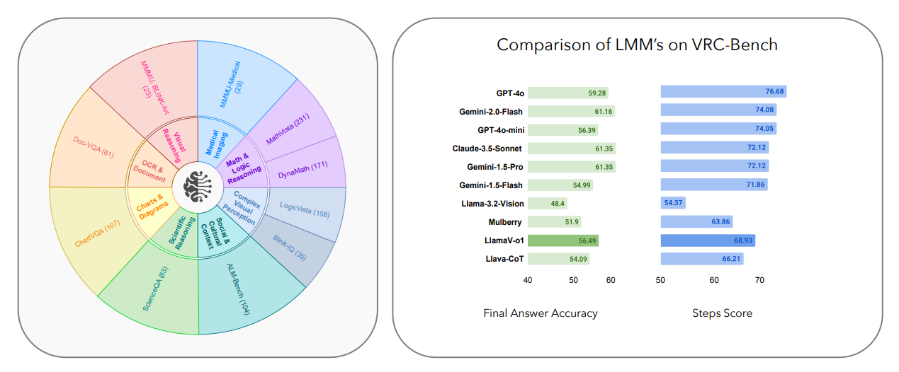
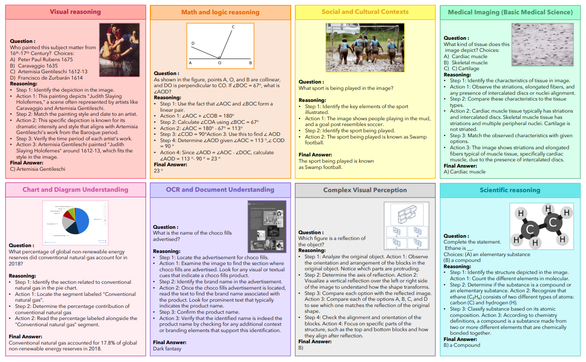
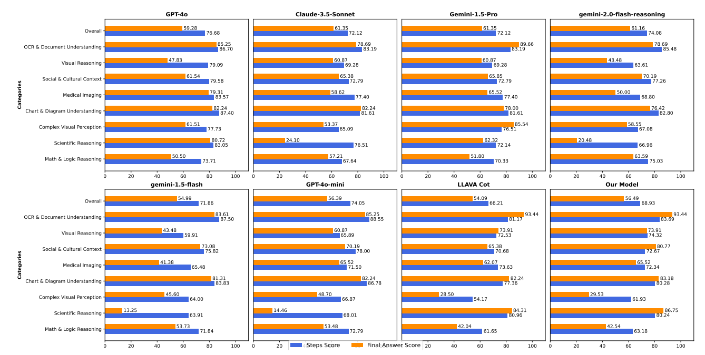

<div align=center>

</div>

<h2 align="center"> LlamaV-o1: Rethinking Step-By-Step Visual Reasoning in LLMs</h2>


[Omkar Thawakar](https://omkarthawakar.github.io/)* , [Dinura Dissanayake](https://github.com/mbzuai-oryx/LlamaV-o1)* , [Ketan More](https://github.com/mbzuai-oryx/LlamaV-o1)* , [Ritesh Thawkar](https://github.com/mbzuai-oryx/LlamaV-o1)* , [Ahmed Heakl](https://scholar.google.com/citations?user=JcWO9OUAAAAJ&hl=en)* , [Noor Ahsan](https://github.com/mbzuai-oryx/LlamaV-o1)* , [Yuhao Li](https://github.com/mbzuai-oryx/LlamaV-o1)* , [Mohammed Zumri](https://github.com/mbzuai-oryx/LlamaV-o1)* , [Jean Lahoud](https://scholar.google.com/citations?user=LsivLPoAAAAJ&hl=en)*, [Rao Muhammad Anwer](https://scholar.google.com/citations?hl=en&authuser=1&user=_KlvMVoAAAAJ), [Hisham Cholakkal](https://scholar.google.com/citations?hl=en&user=bZ3YBRcAAAAJ), [Ivan Laptev](https://scholar.google.com/citations?user=qQP6WXIAAAAJ&hl=en), [Ivan Laptev](https://mbzuai.ac.ae/study/faculty/ivan-laptev/), [Mubarak Shah](https://www.cs.ucf.edu/person/mubarak-shah/), [Fahad Shahbaz Khan](https://scholar.google.es/citations?user=zvaeYnUAAAAJ&hl=en) and [Salman Khan](https://salman-h-khan.github.io/) 

*Equal Contribution

**Mohamed bin Zayed University of Artificial Intelligence, UAE**

<h5 align="center"> If you like our project, please give us a star ⭐ on GitHub for the latest update.</h5>

## 📣 Latest Updates
- **Junuary-13-2025**: Technical Report of LlamaV-o1 is released on Arxiv. [Paper](https://arxiv.org/list/cs.CV/recent)
- **Junuary-10-2025**: *Code, Model & Dataset release. Our VCR-Bench is available at: [HuggingFace](https://huggingface.co/datasets/omkarthawakar/VRC-Bench). Model Checkpoint: [HuggingFace](https://huggingface.co/omkarthawakar/LlamaV-o1). Code is available at: [GitHub](https://github.com/mbzuai-oryx/LlamaV-o1/).🤗
--- 

## 🔥 Highlights

**LlamaV-o1** is a Large Multimodal Model capable of spontaneous reasoning.

- Our LlamaV-o1 model outperforms **Gemini-1.5-flash**,**GPT-4o-mini**, **Llama-3.2-Vision-Instruct**, **Mulberry**, and **Llava-CoT** on our proposed VCR-Bench.

- Our LlamaV-o1 model outperforms **Gemini-1.5-Pro**,**GPT-4o-mini**, **Llama-3.2-Vision-Instruct**, **Mulberry**, **Llava-CoT**, etc. on six challenging multimodal benchmarks (MMStar, MMBench, MMVet, MathVista, AI2D and Hallusion).

## Contributions 🏆
- Step-by-Step Visual Reasoning Benchmark: To the best of our knowledge, the proposed
benchmark is the first effort designed to evaluate multimodal multi-step reasoning tasks
across diverse topics. The proposed benchmark, named VRC-Bench, spans around eight
different categories (Visual Reasoning, Math & Logic Reasoning, Social & Cultural Context,
Medical Imaging (Basic Medical Science), Charts & Diagram Understanding, OCR &
Document Understanding, Complex Visual Perception and Scientific Reasoning) with over
1,000 challenging samples and more than 4k reasoning steps.
- Novel Evaluation Metric: A metric that assesses the reasoning quality at the level of
individual steps, emphasizing both correctness and logical coherence.
- Combined Multi-Step Curriculum Learning and Beam Search Approach: A multimodal rea-
soning method, named LlamaV-o1, that combines the structured progression of curriculum
learning with the efficiency of Beam Search. The proposed approach ensures incremental
skill development while optimizing reasoning paths, enabling the model to be effective in
complex multi-step visual reasoning tasks in terms of both accuracy and efficiency. Specifi-
cally, the proposed LlamaV-o1 achieves an absolute gain of 3.8% in terms of average score
across six benchmarks while being 5× faster, compared to the recent Llava-CoT.
---

### Dataset Overview
<div align=center>

</div>
The figure presents our benchmark structure and the comparative performance of LMMs on VRC-Bench. The dataset spans diverse domains, including mathematical & logical reasoning, scientific reasoning, visual perception, and specialized areas such as medical imaging, cultural understanding, and document OCR. It also includes tasks like chart & diagram comprehension to test real-world applications. The bar chart compares various state-of-the-art models, showcasing final answer accuracy and step-by-step reasoning performance. Our LlamaV-o1 model surpasses GPT-4o-mini, Gemini-1.5-Flash, and Llava-CoT in complex multimodal reasoning tasks, achieving superior accuracy and logical coherence.

## Dataset Examples
<div align=center>

</div>
<hr>

### Results
**Table 1:** Comparison of models based on Final Answer accuracy and Reasoning Steps performance on the proposed VRC-Bench. The best results in each case (closed-source and open-source) are in bold. Our LlamaV-o1 achieves superior performance compared to its open-source counterpart (Llava-CoT) while also being competitive against the closed-source models.

| **Model**   | **GPT-4o** | **Claude-3.5** | **Gemini-2.0** | **Gemini-1.5 Pro** | **Gemini-1.5 Flash** | **GPT-4o Mini** | **Llama-3.2 Vision** | **Mulberry** | **Llava-CoT** | **LlamaV-o1 (Ours)** |
|-------------|------------|----------------|----------------|-------------------|--------------------|----------------|--------------------|-------------|--------------|-------------------|
| **Final Answer** | 59.28      | **61.35**        | 61.16          | **61.35**         | 54.99              | 56.39          | 48.40              | 51.90       | 54.09        | **56.49**         |
| **Reasoning Steps** | **76.68**   | 72.12            | 74.08          | 72.12             | 71.86             | 74.05          | 58.37              | 63.86       | 66.21        | **68.93**         |
---

#### Breakdown for VCR-Bench Categories
<div align=center>

</div>
<hr>

**Table 2:** Performance comparison on six benchmark datasets (MMStar, MMBench, MMVet, MathVista, AI2D, and Hallusion) along with average scores. The comparison includes both closed-source and open-source models. GPT-4o achieves the highest average score (71.8%) among closed-source models, while our LlamaV-o1 leads open-source models with an average score of 67.33%, surpassing Llava-CoT by 3.8%.
| **Model**                | **MMStar** | **MMBench** | **MMVet** | **MathVista** | **AI2D** | **Hallusion** | **Average** |
|--------------------------|------------|-------------|----------|--------------|---------|--------------|------------|
| **Closed-Source**         |            |             |          |              |         |              |            |
| GPT-4o-0806               | 66.0       | 82.4        | 80.8     | 62.7         | 84.7    | 54.2         | **71.8**   |
| Claude3.5-Sonnet-0620     | 64.2       | 75.4        | 68.7     | 61.6         | 80.2    | 49.9         | 66.7       |
| Gemini-1.5-Pro            | 56.4       | 71.5        | 71.3     | 57.7         | 79.1    | 45.6         | 63.6       |
| GPT-4o-mini-0718          | 54.9       | 76.9        | 74.6     | 52.4         | 77.8    | 46.1         | 63.8       |
| **Open-Source**           |            |             |          |              |         |              |            |
| InternVL2-8B             | 62.5       | 77.4        | 56.9     | 58.3         | 83.6    | 45.0         | 64.0       |
| Ovis1.5-Gemma2-9B         | 58.7       | 76.3        | 50.9     | 65.6         | 84.5    | 48.2         | 64.0       |
| MiniCPM-V2.6-8B           | 57.1       | 75.7        | 56.3     | 60.6         | 82.1    | 48.1         | 63.3       |
| Llama-3.2-90B-Vision-Inst | 51.1       | 76.8        | 74.1     | 58.3         | 69.5    | 44.1         | 62.3       |
| VILA-1.5-40B              | 53.2       | 75.3        | 44.4     | 49.5         | 77.8    | 40.9         | 56.9       |
| Mulberry-7B               | 61.3       | 75.34       | 43.9     | 57.49        | 78.95   | 54.1         | 62.78      |
| Llava-CoT                 | 57.6       | 75.0        | 60.3     | 54.8         | 85.7    | 47.8         | 63.5       |
| **Our Models**            |            |             |          |              |         |              |            |
| Llama-3.2-11B (baseline)  | 49.8       | 65.8        | 57.6     | 48.6         | 77.3    | 40.3         | 56.9       |
| **LlamaV-o1 (Ours)**      | **59.53**  | **79.89**   | **65.4** | **54.4**     | **81.24**| **63.51**    | **67.33**  |
---

## 🛠️ Usage

### Pretrained weights ⚡

You can download the pretrained weights of **LlamaV-o1** from the Huggingface: [omkarthawakar/LlamaV-o1](https://huggingface.co/omkarthawakar/LlamaV-o1).

### Dataset 📚

You can download the **VRC-Bench** from the Huggingface: [omkarthawakar/VRC-Bench](https://huggingface.co/datasets/omkarthawakar/VRC-Bench).


### Inference 🏃

You can use sample inference code provided in [eval/llamav-o1.py](eval/llamav-o1.py) where we show sample inference on an image with multi-step reasoning.

#### Load the Model
```python
from transformers import MllamaForConditionalGeneration, AutoProcessor

model_id = "omkarthawakar/LlamaV-o1"

model = MllamaForConditionalGeneration.from_pretrained(
    model_id,
    torch_dtype=torch.bfloat16,
    device_map="auto",
)
processor = AutoProcessor.from_pretrained(model_id)
```

### Train 🚉 
We used [llama-recipes](https://github.com/Meta-Llama/llama-recipes) to finetune our LlamaV-o1.

More details about finetuning will be available soon!


## 📝 Citation

If you find this paper useful, please consider staring 🌟 this repo and citing 📑 our paper:

(Coming Soon!)

## 🙏 Acknowledgement
- This project is primarily distributed under the Apache 2.0 license, as specified in the [LICENSE](https://github.com/mbzuai-oryx/LlamaV-o1/blob/main/LICENSE) file.
- The service is provided as a research preview for non-commercial purposes only, governed by the LLAMA 3.2 Community License Agreement and the Terms of Use for data generated by OpenAI. If you encounter any potential violations, please reach out to us.
